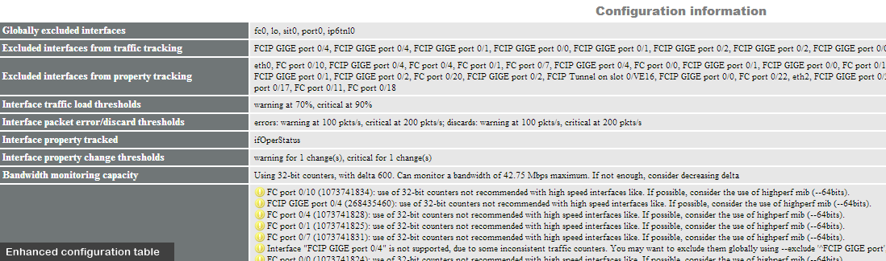
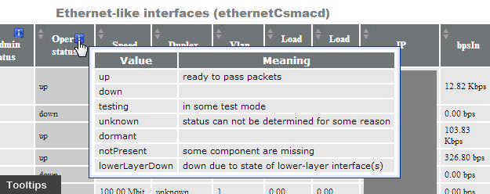
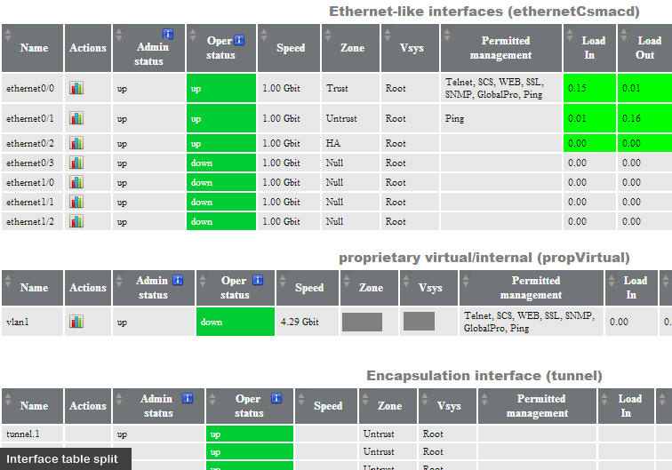
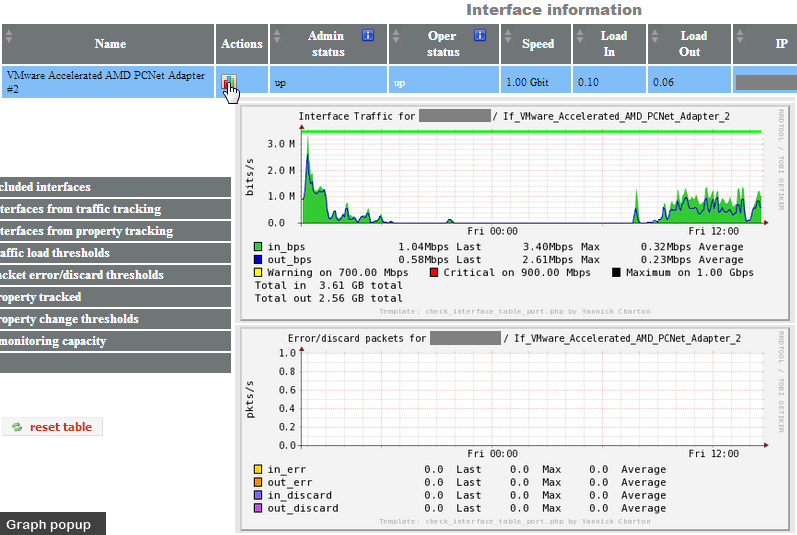
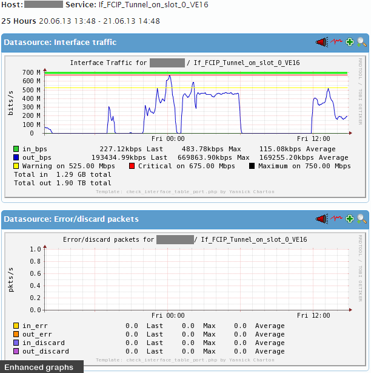

# **[What's new]( "refresh" )**

### Table of contents

  * What's new

# What's new

  * New & enhanced supported node types: Cisco, HP, Netscreen, Netapp (7-mode, cDOT), F5 BigIP, Bluecoat, Brocade, Brocade-NOS, Nortel, EMC Datadomain, Linux/UNIX/Windows/...   

  

  * Major change in the way traffic statistics are calculated and reported: now the rate calculations are done by the plugin itself, and no more by the graphing solution. With this method, abnormal statistics are not transmitted to the graphing solution, leaving the rrd files only with consistent statistics.

    ​

  * Enhanced configuration table with better config sum up, warnings and recommendations

  

  * Tooltips added to describe some interface table columns and their possible values   

  

  * Interface table split feature, splitting by interface type   

  

  * Graph popups directly on the interface table, for quick trend access.   

  

  * Thresholds & other info now graphed.   

  

Complete list of changes available [here](https://raw.githubusercontent.com/Tontonitch/interfacetable_v3t/master/CHANGELOG)
