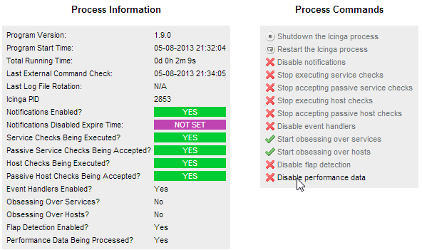
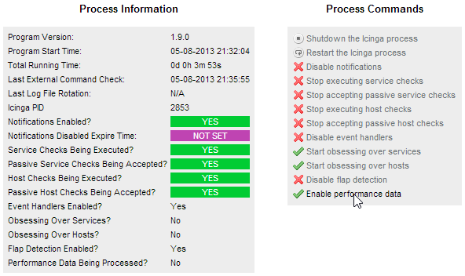
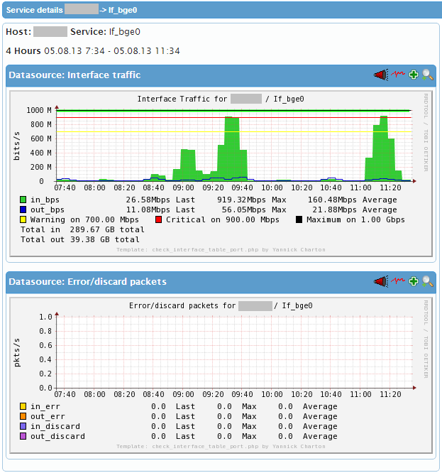

# **Upgrade**

### Table of contents

* [Update & upgrade](#Update_upgrade)
    * [Before update/upgrade (>=0.03)](#Before_update_upgrade_0.03_)
    * [Update](#Update)
    * [Upgrade](#Upgrade)
        * [Upgrade keeping the old method (not recommended)](#Upgrade_keeping_the_old_method_not_recommended_)
            * [From 0.03-x and 0.04-x to 0.05-x](#From_0.03-x_and_0.04-x_to_0.05-x)
            * [From <=0.02-x to 0.05-x](#From_0.02-x_to_0.05-x)
        * [Upgrade switching to the new method](#Upgrade_switching_to_the_new_method)
    *   [Important release notes](#Important_release_notes)
        * [Notes about version 0.05](#Notes_about_version_0.05)
        * [Notes about version 0.04-1](#Notes_about_version_0.04-1)
        * [Notes about version 0.04](#Notes_about_version_0.04)

# Update & upgrade

## Before update/upgrade (>=0.03)

Even if I do my best to avoid any regression, you might want to test that the new release fits to your environment. To test it, you can follow the instructions available in the page [Annexes](10-annexes.md) section *Install_in_testing_mode_for_beta_testers*.

This step-by-step procedure explains how to install the plugin in test-mode (separate installation, avoid any modification of a previous running installation)

## Update

The update of a 0.05-x version (from 0.05-x to 0.05-y) works (nearly) the same way as an installation. Please look at the page [installation instructions](03-installation.md) to install the new requirements if any. Please note that you have to call ./configure with the same options you used during the installation of the previous release. If you still have the installation directory of the previous plugin release, you can check which options have been used by looking at the top of the config.log file. You can generally skip make install-apache-config and make install-sudo-config as nothing should change in the apache and sudo configurations.

Also, the plugin itself performs some version checks when it runs, avoiding any post installation tasks (i.e. cleaning). Consequently, when launched, the script will automatically detect a version change and clean any cached information. Then, it will continue to run as if it was an initial run.

## Upgrade

Interfacetable\_v3t release 0.05 introduces some important changes in the way traffic statistics are calculated and reported. In previous versions, the statistics were collected from counters and were written as counters in the performance data. The graphing solution, in charge of processing the performance data, had to insert counters in the rrd files. During this rrd update, the traffic rate (in bits/octets per second) was calculated. With this method, there is no way to avoid abnormal statistics to be inserted in the rrd files. In this new 0.05 release, the statistics are still collected from counters, but the rates (usually bps) are calculated and transmitted to performance data (no more as counters). The graphing solution, in charge of processing the performance data, have to insert bps values in the rrd files. With this method, abnormal statistics are not transmitted to the graphing solution, leaving the rrd files only with consistent statistics. This new method is now default one in this new release of the plugin. The old method is still available but should be removed in future versions of the plugin.

According to that, there are 2 ways to upgrade an existing installation of the interfacetable\_v3t plugin:

*   you can still use the old method (counters in performance data, not recommended)
*   you can switch to the new method (bps in performance data, default choice now)

### Upgrade keeping the old method (not recommended)

Please KEEP IN MIND that the old method returning counters as performance data will be **REMOVED** from future releases

#### From 0.03-x and 0.04-x to 0.05-x

The upgrade to the 0.05-x version works (nearly) the same way as an installation. Please look at the page [installation instructions](03-installation.md) to install the new requirements if any. Please note that you have to call ./configure with the same options you used during the installation of the previous release. If you still have the installation directory of the previous plugin release, you can check which options have been used by looking at the top of the .config.log file. You can skip make install-apache-config and make install-sudo-config as nothing changed in the apache and sudo configurations.

Also, the plugin performs some version checks when it runs, avoiding any post installation tasks. Consequently, when launched, the script will automatically detect a version change and clean any cached information. Then, it will continue to run as if it was an initial run.

#### From <=0.02-x to 0.05-x

Before the 0.03 release, the plugin was in the form of a single perl script. This is not the case of the 0.03 and higher releases, which are more complex and are packaged with some other resources. To upgrade from a version prior to 0.03, just do a normal new installation of the plugin (see the page [installation instructions](03-installation.md)). It will overwrite the previous plugin script.

### Upgrade switching to the new method

Hereunder the step to switch to this new method.

1. Conversion scenario requirements

  The conversion process has been written for a specific environment, which should be the most wide-spread one. Check that you are in this situation before going through the next steps.

  *   Graphing solution: pnp4nagios  
    Indeed, the conversion script has been written for rrd files generated by pnp4nagios. If you use another graphing solution and you want to keep your historical data, please [contact me](mailto:tontonitch-pro@yahoo.fr).

  *   Pnp4nagios configured with RRD\_STORAGE\_TYPE = MULTIPLE  
    Also, it assumes that one rrd file is generated per performance data. So if you are still using pnp4nagios with RRD\_STORAGE\_TYPE = SINGLE (not recommended at all), please look at the pnp4nagios website and see the benefits of switching to RRD\_STORAGE\_TYPE = MULTIPLE and the [conversion steps](http://docs.pnp4nagios.org/pnp-0.6/rrd_convert).

2. Disable the performance data

  Performance data generation can be disabled

  *   via the cgis  
     

  *   or by stopping nagios/icinga

3. Backup of the perfdata rrd files

  Take a backup of your pnp4nagios rrd directory. Even if the conversion script keeps a backup of the processed rrd files, it is anymay more secure to keep a full backup of the rrd directory before anything. IMHO, creating a tar archive or doing a cp copy (keeping the mtime, cp -Rp) are 2 solutions to achive this backup.  

4. Check the free space requirement

  Be sure that you will have some extra space in the mountpoint / filesystem hosting the rrd files. Indeed, the the script keeps a backup of each converted rrd file, and it can take a certain amount of space. Of course, after the conversion, and if everything is okay, you will certainly remove these backup files (\*.bak)  

5. RRD files conversion

  A conversion script is located in /contrib/utilities

  Launch the conversion script to convert the rrd and xml files:

  ```
  ./convert_rrd_gauge.sh PNP4NAGIOS_RRD_DIRECTORY
  ```

  Script: convert\_rrd\_gauge.sh, script to convert the rrd files generated by interfacetable\_v3t in mode portperfunit=bit (previously the default) to mode portperfunit=bps (default since interfacetable\_v3t 0.05)

  Usage:

  ```
  ./convert_rrd_gauge.sh PNP4NAGIOS_RRD_DIRECTORY
  ```

  Example:

  ```
  [icinga@server]$ ./convert_rrd_gauge.sh /usr/local/pnp4nagios/perfdata/rrd
  ```

  What this script does:

  * Scan the subdirectories of the directory given to the script as argument, for   rrd and xml files to be converted  
      => a list of files to be converted is reported, to let you check that the list is okay

  * For each rrd file of the list

    * the file mtime is gathered,
    * a backup of the file is created (.bak)
    * the RRD DST is converted from COUNTER to GAUGE
    * the file is renamed with the corresponding "bps perfdata file name"
    * mtime is reapplied to the file

  * For each xml file of the list

    * the file mtime is gathered,
    * a backup of the file is created (.bak)
    * the labels and units are adapted to bps mode
    * mtime is reapplied to the file

    Note: the xml files are automatically updated/replaced by pnp4nagios after some (each?) perfdata insertions, so this part is not needed but allows to not wait and directly see the graphs after the conversion.

  Example:

```
[root@snoopy]# cd
/var/tmp/install/Icinga/plugins/interfacetable_v3t/interfacetable_v3t-0.05-rc2/contrib/utilities
[root@snoopy utilities]#
[root@snoopy utilities]# chmod a+x convert_rrd_gauge.sh
[root@snoopy utilities]# ./convert_rrd_gauge.sh /usr/local/pnp4nagios/perfdata/rrd
######################## List of files to convert ##########################
=== Scanning directory /usr/local/pnp4nagios/perfdata/rrd/host1 ===
=== Scanning directory /usr/local/pnp4nagios/perfdata/rrd/host2 ===
=== Scanning directory /usr/local/pnp4nagios/perfdata/rrd/host3 ===
=== Scanning directory /usr/local/pnp4nagios/perfdata/rrd/host4 ===
[...]
############################################################################
 Total to convert:
  * rrd files: 0
  * xml files: 0
 Before continuing, review the list of files to be processed
############################################################################

Do you want to proceed with the conversion? [y|N] y
[...]
[root@snoopy utilities]#
```

6. (Re-)install the plugin

    (Re-)install the plugin without specifying the --with-portperfunit option. It will install by default the plugin with portperfunit = bps.

*   From 0.03-x and 0.04-x to 0.05-x  
    The upgrade to the 0.05-x version works (nearly) the same way as an installation. +Please look at the page [installation instructions](03-installation.md) to install the new requirements if any.  
    Please note that you have to call ./configure with the same options you used during the installation of the previous release.  
    Please note that you have to call ./configure with the same options you used during the installation of the previous release. If you still have the installation directory of the previous plugin release, you can check which options have been used by looking at the top of the .config.log file.  
    You can skip make install-apache-config and make install-sudo-config as nothing changed in the apache and sudo configurations.  
    Also, the plugin performs some version checks when it runs, avoiding any post installation tasks. Consequently, when launched, the script will automatically detect a version change and clean any cached information. Then, it will continue to run as if it was an initial run.
*   From <=0.02-x to 0.05-x  
    Before the 0.03 release, the plugin was in the form of a single perl script. This is not the case of the 0.03 and higher releases, which are more complex and are packaged with some other resources.  
    To upgrade from a version prior to 0.03, just do a normal new installation of the plugin (see the page [installation instructions](03-installation.md)). It will overwrite the previous plugin script.


7. Enable the performance data and check the graphs

  Performance data generation can be enabled

  *   via the cgis  
      

  *   or if you stopped nagios/icinga, just restart it

  Then, check that the graphs can be well generated 

8. Cleaning

  Remove the backup files:

  List the files:

  ```
  find /rrd_directory -name "*\.bak" -type f -exec ls -larth {} \;
  ```

  Remove the files:

  ```
  find /rrd_directory -name "*\.bak" -type f -exec rm {} \;
  ```

Important release notes
-----------------------

### Notes about version 0.05

**IMPORTANT**  

*   the option --portperfunit cannot take the value 'octet' anymore. This option has been removed as not used, for better maintenance, and in the forcast of the unique unit 'bps' in future releases. If you use it, please [contact me](mailto:tontonitch-pro@yahoo.fr).

### Notes about version 0.04-1

**IMPORTANT**  

Please note the following changes introduced by version 0.04-1. It changes the way the plugin behaves with the same plugin options.

*   some new rules on ifOperstatus where introduced, preventing some alerts (normally unexpected alerts):
    *   no ifOperstatus alarms when ifAdminstatus is down
    *   no ifOperstatus alarms when ifOperstatus is changing from down to anything

### Notes about version 0.04

**IMPORTANT**  

Please note the following changes introduced by version 0.04. It changes the way the plugin behaves with the same plugin options.

*   duplex information are now disactivated by default. Use --duplex to activate them.
*   the option --cisco is now replaced by --nodetype=cisco.
*   netsnmp perl bindings is now used by default. In case of problem, you can still use the old way, via the use of linux-unix binaries (default in versions <=0.03x), by using the --unixsnmp option
*   plugin timeout security is now in place, so you may need to extend it with the --timeout option(default is inherited from nagios plugin global timeout)
*   inclusions/exclusions now only try to match the interface names (~= description). In <= v0.03, inclusions/exclusions also try to match the alias. To have the previous behavior back, use the new option --alias-matching
