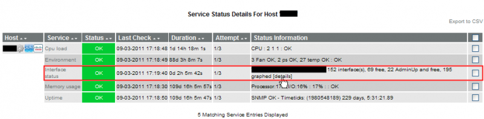
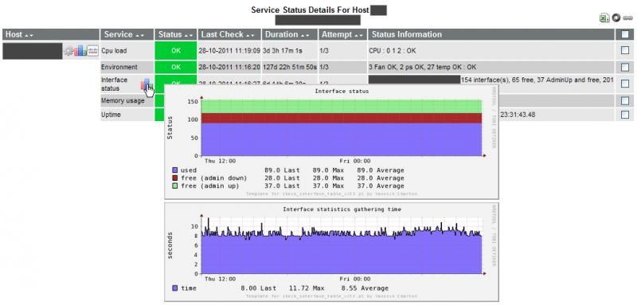
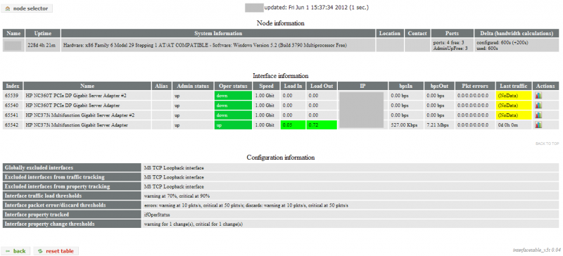

# **Integration in Nagios/Icinga interface**

### Table of contents

*   [Integration in the Nagios web interface](#Integration_in_the_Nagios_web_interface)
    *   [Interface status service](#Interface_status_service)
        *   [Pnp4nagios link/popup](#Pnp4nagios_link_popup)
    *   [Interface table](#Interface_table)

# Integration in the Nagios web interface

## Interface status service

Hereunder is an example with a cisco router. 

The service corresponding to the check of the interface is named 'Interface status'. You can see that the same info as in the email are presents in the status information field. There's also the html link to the interface table.

### Pnp4nagios link/popup

You may also want to see some graphed information directly in the nagios interface, as pnp4nagios popups. That can be done easily using the action\_url directive. See the pnp4nagios documentation for more informations: [http://docs.pnp4nagios.org/pnp-0.6/webfe](http://docs.pnp4nagios.org/pnp-0.6/webfe)

Hereunder is an example of configured directive for a service:

```
action\_url   /pnp4nagios/graph?host=$HOSTNAME$&srv=$SERVICEDESC$'
class='tips' rel='/pnp4nagios/popup?host=$HOSTNAME$&srv=$SERVICEDESC$
```

And a screenshot of the result: 

## Interface table

While processing the interface related data polled by the plugin during interface checks, the plugin also generate a html information page. This page contains 3 tables:

*   a general information table: this table shows some basic information about the host and the check.
*   an interface table: this table gathers all the interface information, including properties such as IP info, speed configuration, alias,... Moreover it shows the load on each interface based on the interface speed and the in/out octet counters.
*   a configuration table: this table shows some important plugin configuration information, including exclusion options impacts, applied thresholds,...

This page can be accessed from multiple sources:

*   A notification email
*   The service status list in the nagios web interface
*   The extended info of an 'Interface' status service



Looking in detail at the interface table above, you can see that different colors are used for some rows/cells. This reflects:

*   interface tracking inclusion/exclusion (help to see which inclusions/exclusions have been used in the service definition)

    *   global tracking: excluded interfaces are represented by black overlayed (css dependent) rows in the interface table. In this example, the Null0 loopback interface has been excluded.

    *   traffic tracking: excluded interfaces are represented by a dark grey (css dependent) cell style in the interface table. In this example, no interface has been excluded.

    *   property tracking: excluded interfaces are represented by a dark grey (css dependent) cell style in the interface table. In this example, only the gigabit interfaces have been included in the property tracking, which only concerns Operstatus.

*   interface property changes: tracked properties go from green to red when a change occurs, and an info showing the old and new state of the property is printed.

*   interface traffic status

    *   traffic load: depending on the thresholds applied and the current traffic load, the load fields (in & out) will be recolorized to  

        * green : traffic load ok  

        * orange : traffic load warning  

        * red : traffic load critical  

        Note: when using the --ifloadgradient option is enabled (default), the load fields will be recolorized with color gradients from green over yellow to red for representing the traffic load
